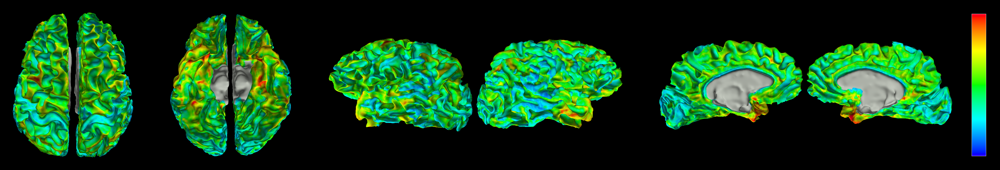
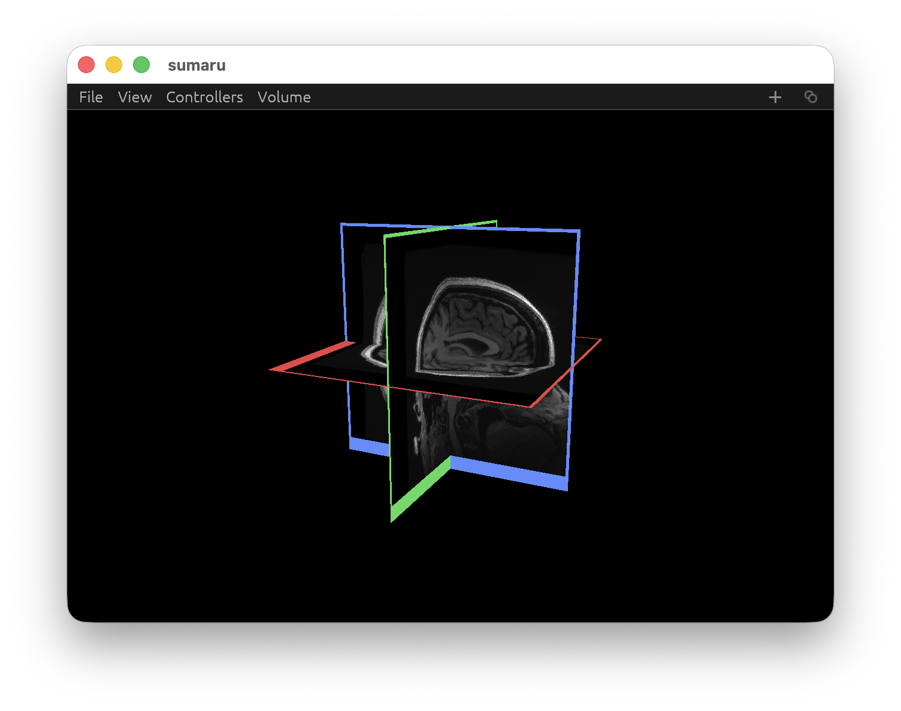
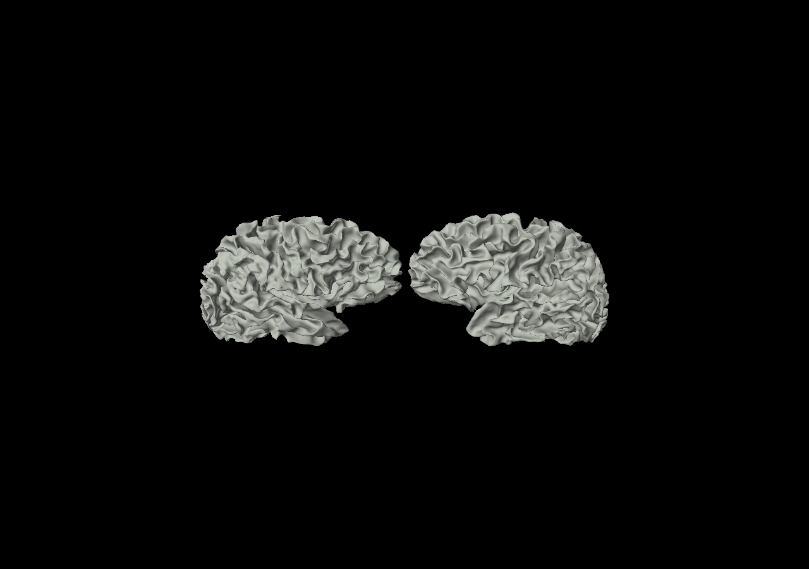
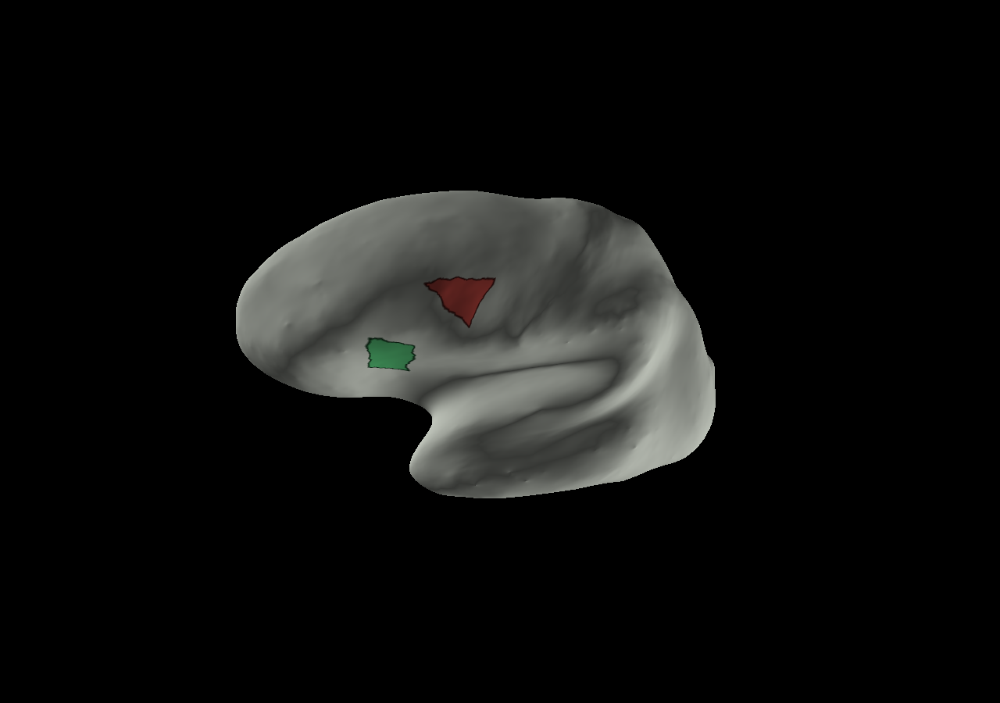
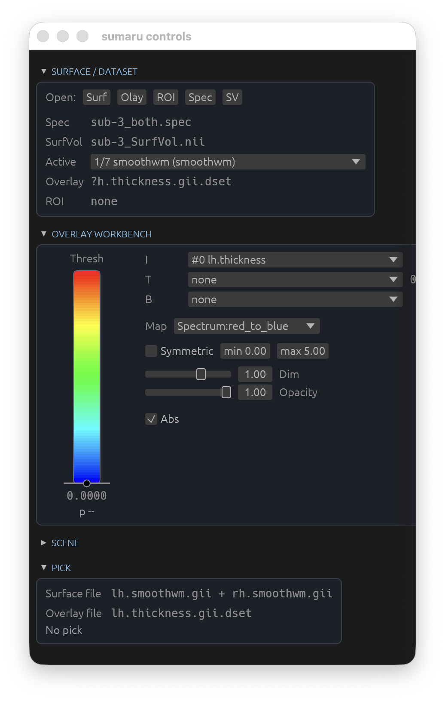

<h1 align="center">sumaru</h1>

<p align="center"><strong>SUMA, in Rust.</strong></p>

<p align="center">
A ground-up Rust rebuild of AFNI's SUMA surface tooling — a fast, native
surface and volume viewer for neuroimaging, built on <code>winit</code>,
<code>wgpu</code>, and <code>egui</code>, with a clean, testable library core
underneath.
</p>

<p align="center">
  
</p>

`sumaru` reads the file formats SUMA workflows depend on — GIFTI surfaces,
`.niml.dset`/`.gii.dset` overlays, `.spec` scenes, `.niml.roi` regions, and NIfTI
volumes — renders them on the GPU, and talks to a running AFNI/SUMA session over
NIML. No SUMA install, no X11, no MATLAB: one Rust binary.

### Why sumaru

- **Native and fast.** GPU rendering through `wgpu`; surfaces, overlays, ROIs,
  and volume slices share one render pass.
- **AFNI-compatible.** Speaks the same NIML talk protocol as SUMA/PySuma —
  connect to a live AFNI session and exchange crosshairs, picks, and overlays.
- **Surfaces *and* volumes.** Inflated/pial/sphere surfaces, paired-hemisphere
  layouts, drawn ROIs, and orthogonal NIfTI slice planes in the same 3D scene.
- **A real library, not just a GUI.** Most behavior lives in the library crate,
  so batch tools, tests, and future renderers share one data model.

### Install
```
git clone https://github.com/pmolfese/sumaru
cd sumaru
cargo build --release
```
Then copy the sumaru binary to somewhere on your path. Use (mostly) like SUMA. 

### A look at the interface

<table>
  <tr>
    <td width="50%"></td>
    <td width="50%"></td>
  </tr>
  <tr>
    <td align="center"><em>Volume mode — draggable axial / coronal / sagittal slice planes</em></td>
    <td align="center"><em>Paired-hemisphere "acorn" layout from a both-hemisphere spec</em></td>
  </tr>
  <tr>
    <td width="50%"></td>
    <td width="50%"></td>
  </tr>
  <tr>
    <td align="center"><em>Drawn ROIs with the ROI controller</em></td>
    <td align="center"><em>Surface / overlay controller</em></td>
  </tr>
</table>

> Screenshots live in [`docs/images/`](docs/images/) — see its README for the
> exact filenames to drop in.

## Current Scope

- GIFTI surface/shape/dataset I/O through `gifti-rs` from `PennLINC/gifti-rs`
- NIFTI volume I/O through `nifti` from `Enet4/nifti-rs`
- SUMA `.spec` parsing for single-hemisphere multi-surface scenes
- A surface viewer through `winit`, `wgpu`, and `egui`, with overlays, drawn
  ROIs, and paired-hemisphere layouts
- A `--volume` mode that renders orthogonal NIfTI slice planes in the 3D scene
- Headless file inspection:

```sh
cargo run
cargo run -- -i /path/to/surface.gii
cargo run -- --surface /path/to/surface.gii
cargo run -- --surface /path/to/surface.gii --overlay /path/to/overlay.shape.gii
cargo run -- --surface /path/to/surface.gii --overlay /path/to/stats.niml.dset
cargo run -- --surface /path/to/surface.gii --overlay /path/to/stats.gii.dset
cargo run -- --surface /path/to/surface.gii --overlay /path/to/stats.niml.dset --verbose
cargo run -- -spec /path/to/subj_rh.spec -sv /path/to/subj_SurfVol.nii
cargo run -- -spec /path/to/subj_rh.spec -sv /path/to/subj_SurfVol.nii --preload
cargo run -- --volume /path/to/subj_SurfVol.nii
cargo run -- inspect /path/to/file.nii.gz
```

## Cargo Commands

The project defines a few Cargo aliases in `.cargo/config.toml`:

```sh
cargo check-all
cargo test-all
cargo fmt-all
cargo surface /path/to/surface.gii
cargo inspect -- /path/to/file.gii
```

## Overlays

`--overlay` accepts a GIFTI file with one numeric value per surface vertex, an
AFNI/SUMA `.niml.dset`, or an AFNI-converted `.gii.dset`. Multi-column datasets
are parsed into the canonical `Dataset` table first; the controller can then
choose intensity, threshold, and brightness columns from the dataset. If the
selected threshold column carries an AFNI stat label such as `Ttest(48)`, the
threshold control can operate in p-value mode.

## AFNI NIML Talk

`sumaru` now has a non-`wgpu` AFNI/SUMA NIML talk layer in the library crate and
a first live viewer bridge. The first concrete AFNI-compatible message subset
is the same practical path used by SUMA and PySuma:

- `SUMA_ixyz`: surface node index and XYZ coordinates sent to AFNI
- `SUMA_node_normals`: per-node normals sent to AFNI
- `SUMA_ijk`: triangle indices sent to AFNI
- `SUMA_irgba`: sparse node RGBA colors and optional threshold/function/volume
  metadata sent from AFNI back to the surface viewer

Launch with `--talk-afni` to connect on startup, or press `T` in the viewer to
toggle AFNI/SUMA NIML talk. Press `Control+T` to force-resend the active surface
geometry. Port selection follows AFNI/SUMA conventions: `--afni-port PORT` uses
an explicit port, while `-np OFFSET`/`--np OFFSET` and `-npb BLOC`/`--npb BLOC`
resolve the same AFNI-style port offsets. `--afni-host` defaults to `127.0.0.1`.
AFNI must be listening for NIML before Sumaru can connect: launch AFNI with
`-niml` (and usually `-yesplugouts` for SUMA-style sessions), or press the
`NIML+PO` button in the AFNI GUI after launch.

For a quick look at any supported file, use the generic inspector. It covers
GIFTI, NIFTI, raw NIML datasets/ROIs/label tables, and recorded NIML traces:

```sh
cargo run -- inspect path/to/file
```

For reproducible AFNI talk debugging, add
`--niml-record path/to/session.nimlrec` to a viewer launch. Sumaru records each
sent and received NIML event with direction, timestamp, and the serialized
payload. Recording is intentionally plain `.nimlrec` for live-session speed;
gzip the file afterward if you want to archive or share it. The debug readers
accept both `.nimlrec` and `.nimlrec.gz`:

```sh
cargo run -- niml inspect path/to/session.nimlrec
cargo run -- niml replay path/to/session.nimlrec.gz
```

Small test messages can be sent directly to an AFNI/SUMA NIML socket:

```sh
cargo run -- --afni-port 53211 niml send raw path/to/message.niml
cargo run -- --afni-port 53211 niml send crosshair --surface-id SURF_ID --node 42 --xyz 1,2,3
cargo run -- --afni-port 53211 niml send command reset-camera
```

Example:

```sh
cargo run -- --spec path/to/fsaverage_lh.spec --sv path/to/SurfVol.nii --talk-afni --niml-record afni_session.nimlrec
```

The same module also defines Sumaru-side NIML state messages for active surface,
crosshair and selected node/triangle, dataset loading, overlay/threshold
settings, controller commands, and ROI state. Those messages route through
shared controller/command state rather than directly mutating viewer-only
fields, so they can be tested without launching the GUI.

## Viewer Controls

- Launch with `cargo run` to open an empty viewer and a separate controls
  window, then use the `Open:` buttons for a surface, overlay, spec, or surface
  volume. The controls window auto-fits to its current contents, capped by
  the monitor size.
- Add `--verbose` to print viewer status messages to the terminal.
- Spec scenes load only the active display state by default. Add `--preload`
  to load all spec surfaces into memory before the viewer opens, so switching
  between surfaces is instant (at the cost of a longer startup).
- Left-drag to orbit.
- Right-click the surface to inspect the nearest node, triangle, and loaded
  overlay value.
- Scroll to zoom.
- Press Space to reset the camera.
- Press `C` to switch camera mode between `orbit` and `turntable`.
- Press `O` to toggle a loaded overlay on or off.
- Press `.` to advance to the next surface in a loaded single-hemisphere
  `.spec` scene, or the next matched left/right state pair in a `both` scene.
  Press `,` to move backward.
- In a `both` spec scene, use `Open` and `Close` in the VIEW section to
  persistently switch between the closed and acorn paired-hemisphere layouts.
  Hold Control and left-drag in the viewer to fine-tune the pair: left/right
  adjusts the open angle, and up/down adjusts the gap between hemispheres.
- In a `both` spec scene, press `[` to show/hide the left hemisphere and `]` to
  show/hide the right hemisphere.
- Press `r` to save the current view as a PNG, or Shift-`R` to save a 1x4
  montage. Single-surface scenes use left/right/top/bottom views; `both` spec
  scenes use closed top, closed bottom, open medial-in, and open outer-out
  views. The VIEW section also has `Save` and `Montage` buttons. When a
  thresholded overlay is active, a second `_cmap`-suffixed file is saved
  alongside the screenshot with the colorbar rendered on the right side.
- Press `F5` to switch the background between black and white.
- Press `g` to open or close the graph dock at the bottom of the view window.
  When open, right-click picks update the graph live. Drag the handle at the
  top of the dock to resize it; the 3D viewport adjusts to match.
- Hold Option and press an arrow key for preset views:
  - Option-Left: left side view
  - Option-Right: right side view
  - Option-Up: top-down view
  - Option-Down: bottom-up view
- The view menu bar has two right-aligned icon buttons: `+` launches a new blank
  `sumaru` window, and the copy icon duplicates the current surface/spec (no
  overlay) into a fresh window for a second analysis view.

## Volume Slices

Launch with `--volume path/to/volume.nii` (or `.nii.gz`) to render a NIfTI
volume as orthogonal slice planes inside the 3D scene. All three planes show by
default, color-coded by orientation: **axial red, coronal green, sagittal
blue**, each with a colored grab tab.

- **Right-click** a plane to select it (its border brightens).
- **Left-drag** the selected plane to scrub it along its axis; left-drag with no
  plane selected still orbits the camera.
- **Right-click empty space** to deselect.
- The **Volume** menu adds a second parallel slice of any orientation
  ("Add Axial/Coronal/Sagittal slice") or removes the selected one, so you can
  view two depths of the same orientation at once.

Slices share the surface camera and depth buffer; the slice shader reconstructs
each fragment's voxel coordinate from the file's voxel↔world affine, so planes
stay correct under any orientation.

## Design Direction

The binary crate should stay thin. Most behavior should live in the library
crate so future renderers, GUI experiments, batch tools, and tests can share
the same data model.

See `docs/ROADMAP.md` for the active to-do plan and `docs/COMPLETED.md` for
the completed-work ledger.

## Project File Guide

- `Cargo.toml` defines the `sumaru` package, Rust edition/toolchain floor,
  dependencies, and lint policy. This is where core libraries like `gifti-rs`,
  `nifti`, `winit`, `wgpu`, `egui`, `rfd`, `clap`, and `glam` are wired in.
- `Cargo.lock` records exact dependency versions so rebuilds use the same crate
  graph.
- `.cargo/config.toml` defines local Cargo aliases such as `cargo check-all`,
  `cargo surface`, and `cargo inspect`.
- `.gitignore` keeps Cargo build output in `target/` out of version control.
- `README.md` is the project-facing quickstart: scope, commands, controls,
  overlays, design direction, and this file guide.
- `docs/ROADMAP.md` is the active to-do plan, grouped by shared foundations
  such as AFNI interop, command state, everyday viewer use, GPU work, and
  volume support.
- `docs/COMPLETED.md` is the completed-work ledger for bootstrap, data model,
  geometry, viewer, ROI, spec, and rendering performance milestones.
- `src/lib.rs` is the library crate entry point. It exposes the reusable modules
  so the binary, tests, and future tools can share the same implementation.
- `src/afni.rs` contains the first AFNI/SUMA NIML talk layer. It resolves
  AFNI-style ports, builds `SUMA_ixyz`/`SUMA_node_normals`/`SUMA_ijk` surface
  registration elements, parses `SUMA_irgba` overlays, maps incoming NIML
  messages to shared controller actions, and emits Sumaru state messages.
- `src/command.rs` contains the shared controller and command state used to
  route viewer menus, keyboard shortcuts, controller panels, and AFNI messages
  through the same non-`wgpu` model. It owns the canonical `OverlayThreshold`
  type (used by both the render appearance and the controller command state) and
  `ValueRange` (`f32` render range), keeping the render/domain boundary explicit.
- `src/main.rs` is the command-line entry point. It parses `sumaru` arguments,
  launches the viewer with an initial surface or `.spec` scene, requires `-sv`
  surface-volume context for `.spec` launches, handles `--overlay`, passes
  through `--verbose` terminal logging, controls spec preloading with
  `--preload`, opens a NIfTI volume in slice-plane mode with `--volume`, and runs
  the `inspect` subcommand.
- `src/color.rs` contains shared RGBA, continuous color-map, and label-table
  models for scalar maps and integer label datasets, including GIFTI and
  FreeSurfer import helpers. Continuous colormaps include 13 byte-exact AFNI
  colorscales ported from `DC_spectrum_AJJ` / `DC_spectrum_ZSS` (the
  same LUT engine SUMA uses): `Spectrum:red_to_blue`, both `+gap` variants,
  `Spectrum:yellow_to_red`, `Spectrum:yellow_to_cyan` and its `+gap` variant,
  `color_circle_AJJ`, `color_circle_ZSS`, `Reds_and_Blues`,
  `Reds_and_Blues_w_Green`, `afni_p2spanned`, `bwr`, and `Fire`.
- `src/dataset.rs` contains the canonical domain-attached dataset table model.
  It supports dense and sparse row-to-node data, typed columns, column labels
  and roles, numeric ranges (`ColumnRange`, the `f64` domain range type),
  units, and parent/provenance ids.
- `src/inspect.rs` contains headless file inspection. It detects GIFTI/NIFTI
  paths, reads them through the current external crates, and prints concise
  metadata summaries.
- `src/io/` is the native AFNI/SUMA I/O layer, split into a thin `mod.rs`
  re-export facade over topical submodules: `io/niml.rs` (the NIML element model,
  ASCII/binary parser and serializer, label tables, and low-level text/number
  helpers), `io/gifti.rs` (GIFTI dataset loading and NIFTI-intent → column-role
  mapping), and `io/roi.rs` (`.niml.roi` read/write and the side/drawing-type
  code mappers). Callers keep using `crate::io::*`; the facade is the migration
  seam toward the external `afni_rust` crate (see `docs/ROADMAP.md`).
- `src/volume.rs` loads a NIfTI volume into a dense scalar grid plus the
  voxel↔world transform (`VolumeSpace`) and intensity range, ready for the
  `--volume` slice-plane renderer.
- `src/overlay.rs` contains display state layered on datasets. It selects
  intensity/threshold/brightness columns, stores color-map and range controls,
  and builds per-node RGBA color caches for rendering.
- `src/roi.rs` contains the shared ROI model for drawn, imported, dataset-born,
  and threshold-derived surface regions. It stores labels, styling,
  parent-surface/domain links, source/provenance, path history, domain
  validation, and conversion into sparse ROI datasets.
- `src/spec.rs` parses SUMA `.spec` files into surface groups, states,
  hemisphere labels, resolved surface paths, local domain/curvature parents,
  anatomical flags, and label-dataset references.
- `src/surface.rs` contains the current surface data model and GIFTI surface
  adapter. It loads vertices/triangles, validates indices, computes bounds and
  normals, records SUMA-inspired domain/metadata/lineage, and stores scalar
  overlay values/ranges without depending on viewer rendering details.
- `src/viewer/mod.rs` is the viewer core. It sets up the `winit` event loop,
  owns the four windows (view, control, roi_control, graph) as `WindowPane`
  values, integrates `egui` via `EguiPane`, owns `ViewerState`, dispatches
  `ViewerCommand`s, loads surfaces/overlays/volumes, and drives render/update.
  The feature-specific behavior lives in the topical submodules below (each an
  `impl ViewerState` block reached through `use super::*`), so `mod.rs` reads as
  a table of contents rather than an encyclopedia.
- `src/viewer/input.rs` routes window input: the view window's mouse/keyboard
  handling (camera, pair-drag, ROI picking, volume slice scrubbing, keyboard
  shortcuts) plus the egui passthrough for the control, ROI, and graph windows.
- `src/viewer/ui.rs` holds all `egui` panel drawing: the view menu bar, the
  surface/overlay workbench, ROI/pick sections, and the graph window/dock.
- `src/viewer/camera.rs` contains the viewer camera model: orbit and turntable
  modes, preset orientations, scroll zoom, mouse drag handling, and camera
  uniform packing for the shader.
- `src/viewer/scene.rs` owns the multi-surface scene and GPU render set:
  `SurfaceScene`/`SceneSurface` and the resident vertex/index buffers.
- `src/viewer/overlay_load.rs` loads single and paired overlays and refreshes
  the overlay columns, appearance, and render model.
- `src/viewer/roi.rs` holds the drawn-ROI editing, fill, save, and load logic
  plus the ROI workspace/slot/draft types.
- `src/viewer/pairing.rs` handles paired-hemisphere drag, transform, and layout.
- `src/viewer/afni.rs` holds the viewer-side AFNI/SUMA NIML talk bridge.
- `src/viewer/capture.rs` and `src/viewer/screenshot.rs` handle screenshot and
  montage capture: camera framing, `wgpu` readback → RGBA, PNG writing, and
  preset-view montage stitching.
- `src/viewer/graph.rs` manages the picked-node graph window and dock.
- `src/viewer/transform.rs` holds the paired-hemisphere layout math (matrices,
  auto-spread/clearance heuristics, open-book gesture bookkeeping).
- `src/viewer/volume_view.rs` is the `--volume` GPU state: the 3D intensity
  texture, the orthogonal slice-plane pipeline, slice add/remove/select/drag,
  and the `ViewerState` handlers that drive it.
- `src/viewer/gpu.rs` contains small `wgpu` setup helpers such as surface
  format/present-mode selection and the depth-buffer texture.
- `src/viewer/mesh.rs` prepares durable surface/overlay data for the viewer. It
  normalizes positions, flattens triangle indices, assigns default or overlay
  colors, and packs vertex/index bytes for GPU upload.
- `src/viewer/pick.rs` contains right-click surface inspection and the shared
  camera-ray builder. It intersects the cursor ray with normalized triangles and
  reports the hit triangle, nearest node, and overlay value.
- `src/viewer/shader.wgsl` contains the lit surface rendering shader;
  `src/viewer/volume_slice.wgsl` contains the volume slice-plane shader (window/
  level grayscale with per-fragment voxel reconstruction).
- `target/` is generated by Cargo when you build or run the project. It is not
  source code and can be regenerated at any time.
