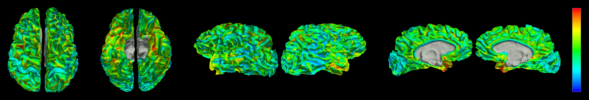
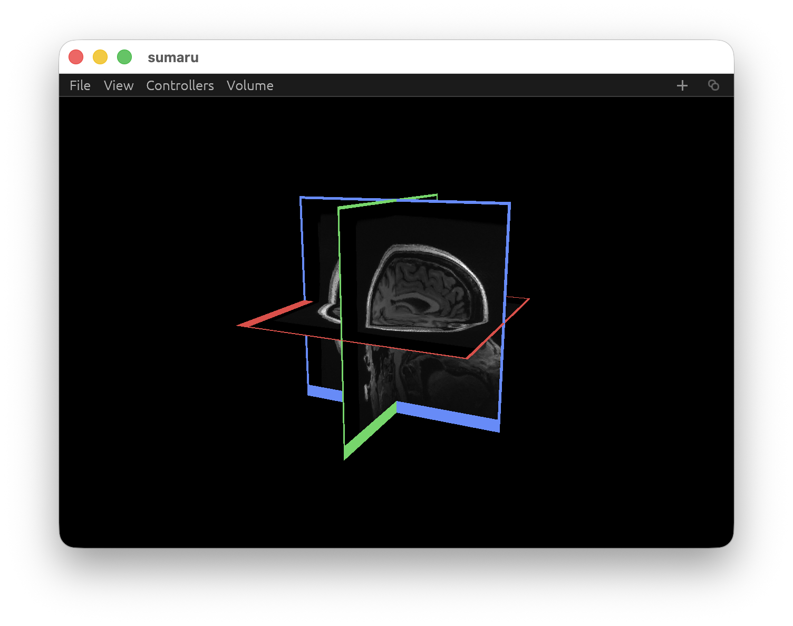
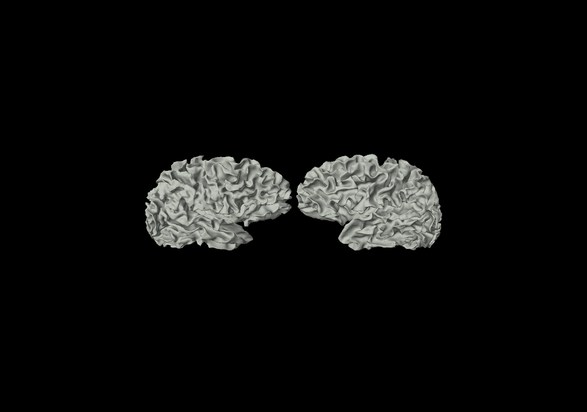
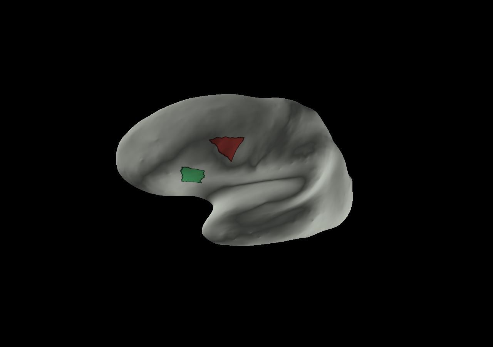
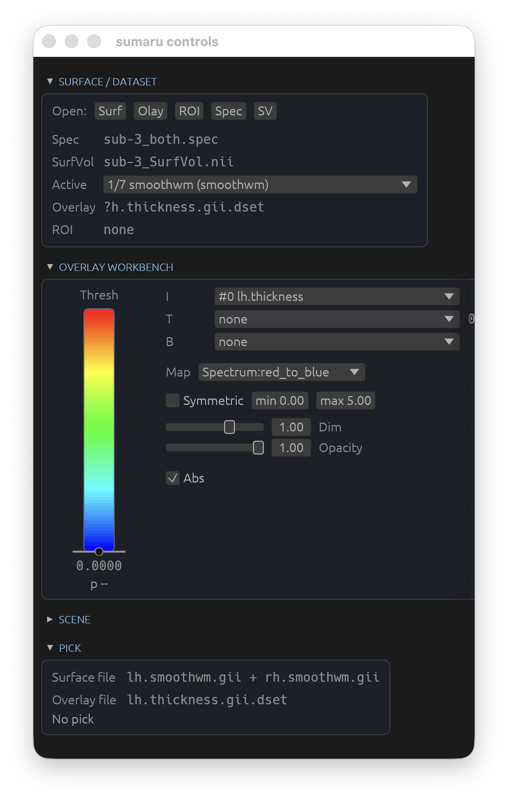

<h1 align="center">sumaru</h1>

<p align="center"><strong>An experimental Rust viewer for SUMA-style neuroimaging data.</strong></p>

<p align="center">
I have been working on <code>sumaru</code> as a way to try out some ideas about
3D neuroimaging viewers: native GPU rendering, a testable Rust data model, and
day-to-day compatibility with the kinds of files people already use with
AFNI/SUMA.
</p>

<p align="center">
  
</p>

`sumaru` is not SUMA, and it is not trying to replace the full AFNI ecosystem.
It started as an experiment. The nice surprise is that it has become functional
enough to use like a partial SUMA-style drop-in for common 3D viewing tasks:
opening GIFTI surfaces, loading `.niml.dset`/`.gii.dset` overlays, stepping
through `.spec` scenes, drawing or reading `.niml.roi` regions, checking NIfTI
slice planes, and talking to a running AFNI/SUMA session over NIML.

If your current SUMA workflow is working, keep using it. This project may be
worth considering when you want a small native viewer, a Rust codebase that is
pleasant to experiment in, or a quick way to look at surface and volume data
without moving it into a different ecosystem.

## Why This Might Be Useful

- **It works with familiar files.** The goal is to open the files scientists
  already have from AFNI/SUMA and related surface workflows, not ask for a new
  project format first.
- **It is responsive enough for everyday inspection.** Rendering goes through
  `wgpu`, so surface rotation, overlays, ROIs, paired hemispheres, and volume
  slices can stay interactive while you are checking data.
- **Surfaces and volumes can share one scene.** This is handy for sanity checks:
  Does the surface line up with the anatomical volume? Is the overlay sitting
  where expected? Are the slice planes telling the same story as the surface?
- **It can sit next to AFNI.** The NIML talk bridge is early, but it already
  supports the practical path of connecting to AFNI/SUMA and exchanging picks,
  geometry, and overlay colors.
- **The internals are meant to be testable.** Most of the behavior lives in the
  library crate rather than being buried inside the GUI. That matters for
  scientific software, where boring details like coordinates, thresholds, and
  file parsing deserve tests.

## Status

This is research software and still changing. It is quite functional for a
viewer, but it is also an experiment: some SUMA features are missing, behavior
may move around, and you should verify results with the same care you would give
any new tool in an analysis workflow.

At the moment, the project is most useful for people who are comfortable trying
a source build, comparing behavior against tools they already trust, and filing
small, concrete issues when real datasets expose rough edges.

## Install

This is currently a source build:

```
git clone https://github.com/pmolfese/sumaru
cd sumaru
cargo build --release
```
Then copy the `sumaru` binary to somewhere on your path, or run it through
`cargo run` while experimenting.

## A Look at the Interface

<table>
  <tr>
    <td width="50%"></td>
    <td width="50%"></td>
  </tr>
  <tr>
    <td align="center"><em>Volume mode: draggable axial / coronal / sagittal slice planes</em></td>
    <td align="center"><em>Paired-hemisphere "acorn" layout from a both-hemisphere spec</em></td>
  </tr>
  <tr>
    <td width="50%"></td>
    <td width="50%"></td>
  </tr>
  <tr>
    <td align="center"><em>Drawn ROIs with the ROI controller</em></td>
    <td align="center"><em>Surface / overlay controller</em></td>
  </tr>
</table>

Screenshot files are kept in [`docs/images/`](docs/images/) so they can be
refreshed as the viewer changes.

## What Works Right Now

- GIFTI surface/shape/dataset I/O through `gifti-rs` from `PennLINC/gifti-rs`.
- NIfTI volume I/O through `nifti` from `Enet4/nifti-rs`, plus native AFNI
  HEAD/BRIK volume loading.
- SUMA `.spec` parsing for the common single-hemisphere and paired-hemisphere
  viewer cases I have been testing.
- A surface viewer through `winit`, `wgpu`, and `egui`, with overlays, drawn
  ROIs, and paired-hemisphere layouts.
- A `tc` timecourse mode for MNE-style 3D+time GIFTI overlays, with playback,
  baseline correction, response windows, peak/mean/AUC maps, and activation
  thresholds.
- A `--volume` mode that renders orthogonal NIfTI slice planes in the 3D scene.
- AFNI/FATCAT `.niml.tract` objects with adjustable screen-space ribbon width,
  per-bundle visibility/opacity, and SUMA-style local-orientation,
  tract-orientation, or bundle coloring.
- AFNI `Graph_Bucket .niml.dset` objects with shaded 3D node glyphs, straight
  or tract-bundle edges, and an interactive matrix view; full, triangular, and
  sparse edge encodings are parsed.
- Headless file inspection for quick metadata checks.

Some useful ways to launch it:

```sh
cargo run
cargo run -- -i /path/to/surface.gii
cargo run -- --surface /path/to/surface.gii
cargo run -- --surface /path/to/surface.gii --overlay /path/to/overlay.shape.gii
cargo run -- --surface /path/to/surface.gii --overlay /path/to/stats.niml.dset
cargo run -- --surface /path/to/surface.gii --overlay /path/to/stats.gii.dset
cargo run -- --surface /path/to/surface.gii --overlay /path/to/stats.niml.dset --verbose
cargo run -- tc -i /path/to/underlay-lh.gii --overlay /path/to/stc-lh.gii
cargo run -- -spec /path/to/subj_rh.spec
cargo run -- -spec /path/to/subj_rh.spec -sv /path/to/subj_SurfVol.nii
cargo run -- -spec /path/to/subj_rh.spec -sv /path/to/subj_SurfVol.nii --preload
cargo run -- --volume /path/to/subj_SurfVol.nii
cargo run -- --volume /path/to/anat+tlrc.
cargo run -- --tract /path/to/network.niml.tract
cargo run -- --volume /path/to/anat.nii.gz --tract /path/to/network.niml.tract
cargo run -- --graph /path/to/network.niml.dset
cargo run -- --vol /path/to/anat+orig. --gdset /path/to/network.niml.dset
cargo run -- -vol /path/to/anat+orig. -gdset /path/to/network.grid
cargo run -- inspect /path/to/file.nii.gz
```

For SUMA compatibility, `--vol` aliases `--volume`, while `--gdset` and
`--grid` alias `--graph`. The single-dash SUMA spellings `-vol`, `-gdset`, and
`-grid` are accepted as well.

Tracts and graphs are independent scene objects: several may be loaded at
once, either alone or beside surfaces and volume slices. Use the
`TRACTS / GRAPHS` controls to select an object, show or hide it, adjust ribbon
width and opacity, change tract coloring, control individual bundles, select a
graph edge measure and threshold, resize graph nodes, or remove it. Reopening
an already loaded path refreshes and activates that object.
Right-click a visible tract, graph node, or displayed graph edge to inspect it.
Graph node labels can be toggled per object. Tract hit-testing uses a compact
streamline bounding-volume hierarchy so large whole-brain datasets do not scan
every segment for each click.
Choose **Open matrix view** in a graph's inspector for a floating, scrollable
heatmap. It shares the 3D graph's selected measure, signed/magnitude coloring,
and absolute-value threshold; thresholded cells are dimmed rather than removed.
The view can show the full matrix or its lower triangle, and clicking a cell
selects that edge in the normal graph selection readout.
When a `Graph_Bucket` contains a `network_file` link, Sumaru resolves and loads
the associated `.niml.tract` network. The graph defaults to straight edges like
SUMA; choose **linked tract bundles** in the graph inspector to replace each
edge with the bundle identified by its `Bundle_Tag` or reciprocal
`Bundle_Alt_Tag`. Thresholding, coloring, and picking continue to use the
selected graph measure, and unmatched edges retain the straight-edge fallback.

## Cargo Commands

The project defines a few Cargo aliases in `.cargo/config.toml`:

```sh
cargo check-all
cargo test-all
cargo fmt-all
cargo surface /path/to/surface.gii
cargo inspect -- /path/to/file.gii
```

## Overlays

`--overlay` accepts a GIFTI file with one numeric value per surface vertex, an
AFNI/SUMA `.niml.dset`, or an AFNI-converted `.gii.dset`. Multi-column datasets
are parsed into the canonical `Dataset` table first; the controller can then
choose intensity, threshold, and brightness columns from the dataset. If the
selected threshold column carries an AFNI stat label such as `Ttest(48)`, the
threshold control can operate in p-value mode. Embedded GIFTI FDR curves are
used automatically. If a statistical `.gii.dset` has no embedded curve, set
`GIFTI_DSET_AUTO_QCALC = YES` in `~/.sumaru` (or enable the matching preference)
to reconstruct q-values while loading; the default is `NO`. Treat this as a viewer
convenience rather than a statistics package: it is meant to help inspect the
data you already understand.

Opening another overlay adds it to the overlay workbench and makes it active.
Use the dataset selector or Control-PageUp/Control-PageDown to switch between
loaded overlays; only the active overlay is rendered. Reopening an existing
source refreshes its existing list entry rather than adding a duplicate, and a
left/right dataset pair is represented by one entry.

The Settings > Preferences panel controls how thresholds move between overlays.
The default keeps the current numeric slider value. The alternatives match the
p-value when both datasets carry compatible stat metadata, or remember a
separate threshold for every overlay. Preferences are saved automatically in
`~/.sumaru`; on first launch Sumaru creates the fully documented default file
if it does not already exist. The file follows the self-documenting AFNI/SUMA `~/.sumarc`
convention: it has an `***ENVIRONMENT` section, stable preference keys, and
an adjacent description, allowed values, and default for every setting. The
current threshold policy is stored as `SUMARU_OverlayThresholdSync`; optional
GIFTI q-value reconstruction is stored as `GIFTI_DSET_AUTO_QCALC`. Older
minimal files using `overlay_threshold_sync` remain readable and are migrated
to the documented form the next time Preferences saves the file.

## Timecourse Mode

Launch a surface timecourse directly with:

```sh
sumaru tc -i underlay-lh.gii --overlay stc-lh.gii
```

If matching `-rh` files exist beside the supplied `-lh` files, Sumaru loads
both hemispheres automatically. `--surface-rh` and `--overlay-rh` can specify
the partners explicitly. A single hemisphere works normally.

The bottom timecourse dock drives the existing surface renderer. Move the time
slider or press **Play** to display successive samples. Select a baseline and
choose raw values, baseline subtraction, or baseline z-scores. Select a
response window and show its mean, positive peak, negative peak, signed
absolute peak, or trapezoidal area under the curve on the surface. The
activation threshold can be signed or absolute and uses the normal overlay
masking path. Right-click any surface node to add its full timecourse to the
dock; blue and orange bands mark the baseline and response windows, and the
white cursor line is the time currently displayed on the surface. Click the
graph to move the cursor, drag across it to select the response window, or
Shift-drag to select the baseline window.

MNE-style GIFTI metadata keys `TimeStart` and `TimeStep` are read in seconds.
When absent, Sumaru falls back to a zero start and one-second spacing so the
data remain inspectable, but correctly exported metadata are required for
meaningful ERP/ERF timing and AUC units.

## AFNI NIML Talk

`sumaru` has an early AFNI/SUMA NIML talk layer in the library crate and a live
viewer bridge. The first useful AFNI-compatible message subset follows the same
practical path used by SUMA and PySuma:

- `SUMA_ixyz`: surface node index and XYZ coordinates sent to AFNI
- `SUMA_node_normals`: per-node normals sent to AFNI
- `SUMA_ijk`: triangle indices sent to AFNI
- `SUMA_irgba`: sparse node RGBA colors and optional threshold/function/volume
  metadata sent from AFNI back to the surface viewer

Launch with `--talk-afni` to connect on startup, or press `T` in the viewer to
toggle AFNI/SUMA NIML talk. Press `Control+T` to force-resend the active surface
geometry. Port selection follows AFNI/SUMA conventions: `--afni-port PORT` uses
an explicit port, while `-np OFFSET`/`--np OFFSET` and `-npb BLOC`/`--npb BLOC`
resolve the same AFNI-style port offsets. `--afni-host` defaults to `127.0.0.1`.
AFNI must be listening for NIML before `sumaru` can connect: launch AFNI with
`-niml` (and usually `-yesplugouts` for SUMA-style sessions), or press the
`NIML+PO` button in the AFNI GUI after launch.

For a quick look at any supported file, use the generic inspector. It covers
GIFTI, NIFTI, raw NIML datasets/ROIs/label tables, and recorded NIML traces:

```sh
cargo run -- inspect path/to/file
```

For reproducible AFNI talk debugging, add
`--niml-record path/to/session.nimlrec` to a viewer launch. `sumaru` records each
sent and received NIML event with direction, timestamp, and the serialized
payload. Recording is intentionally plain `.nimlrec` for live-session speed;
gzip the file afterward if you want to archive or share it. The debug readers
accept both `.nimlrec` and `.nimlrec.gz`:

```sh
cargo run -- niml inspect path/to/session.nimlrec
cargo run -- niml replay path/to/session.nimlrec.gz
```

Small test messages can be sent directly to an AFNI/SUMA NIML socket:

```sh
cargo run -- --afni-port 53211 niml send raw path/to/message.niml
cargo run -- --afni-port 53211 niml send crosshair --surface-id SURF_ID --node 42 --xyz 1,2,3
cargo run -- --afni-port 53211 niml send command reset-camera
```

Example:

```sh
cargo run -- --spec path/to/fsaverage_lh.spec --sv path/to/SurfVol.nii --talk-afni --niml-record afni_session.nimlrec
```

The same module also defines `sumaru`-side NIML state messages for active surface,
crosshair and selected node/triangle, dataset loading, overlay/threshold
settings, controller commands, and ROI state. Those messages route through
shared controller/command state rather than directly mutating viewer-only
fields, so they can be tested without launching the GUI.

## DriveSuma

Sumaru can listen for the NIML `EngineCommand` messages produced by AFNI's
`DriveSuma` program. There are two intentionally different command modes:

- `-niml` / `--niml` uses Sumaru's native key meanings. For example, remote
  `Control+R` opens the ROI controller and `R` saves a montage.
- `-niml-suma` / `--niml-suma` translates the supported SUMA subset.
  `-niml-compat` / `--niml-compat` is an alias. In this mode SUMA-style dataset
  controls, key translations, clustering, and `kill_suma` are enabled.

Start Sumaru first, using the same port bloc that will be passed to DriveSuma:

```sh
sumaru -spec Demo.spec -sv Demo_SurfVol+orig. -niml-suma -npb 1000

DriveSuma -npb 1000 \
  -com surf_cont -surf_label Net_000.gii \
  -load_dset Net_000.cols.niml.dset \
  -switch_cmap ROI_i32 -Dim 0.3
```

Compatibility mode currently supports selecting an already loaded surface,
loading and switching overlay datasets, intensity/threshold/brightness
sub-bricks and ranges, numeric/p-value/percentile thresholds, brightness scale,
dim and opacity, dataset visibility and display modes, zero masking, and
SUMA-style cluster settings. The translated key subset covers camera movement
and presets, render style and opacity, background, screenshots, graph opening,
component visibility, and surface/state cycling.

Sumaru deliberately uses one view per process instead of SUMA's several
lettered viewers in one application. Start separate Sumaru processes with
different `-npb` values for independently scripted views. Likewise, Sumaru
renders only the active overlay: `1_only=y` is its natural behavior, while
`1_only=n` is accepted but does not enable simultaneous overlay compositing.

See [DriveSuma compatibility](docs/DRIVESUMA.md) for the full command table,
key translations, cluster sign conventions, native-versus-compatibility
differences, examples, diagnostics, and known limitations.

## Viewer Controls

- Launch with `cargo run` to open an empty viewer and a separate controls
  window, then use the `Open:` buttons for a surface, overlay, spec, or surface
  volume. The controls window auto-fits to its current contents, capped by
  the monitor size.
- Add `--verbose` to print viewer status messages to the terminal.
- Spec scenes load only the active display state by default. Add `--preload`
  to load all spec surfaces into memory before the viewer opens, so switching
  between surfaces is instant (at the cost of a longer startup).
- Left-drag to orbit.
- Right-click the surface to inspect the nearest node, triangle, and loaded
  overlay value.
- With a surface time-series overlay active, press `D` to open or toggle
  InstaCorr. Its floating panel exposes a SUMA preprocessing switch plus
  editable TR, polort, and bandpass settings; press **Recalculate** to apply
  changes. Turning preprocessing off disables those dependent settings and
  computes a raw dot product, matching SUMA's `normalize_dset` gate. Ordinary
  right-clicks then update the seed using the applied settings.
  Shift-right-click moves the crosshair without recalculating InstaCorr.
- Scroll to zoom.
- Press Space to reset the camera.
- Press `C` to switch camera mode between `orbit` and `turntable`.
- Press Shift-`V` to toggle a loaded overlay on or off.
- Press Control-PageUp or Control-PageDown to move through the ordered overlay
  list. The same actions are available beside the dataset selector in the
  overlay workbench.
- Press `.` to advance to the next surface in a loaded single-hemisphere
  `.spec` scene, or the next matched left/right state pair in a `both` scene.
  Press `,` to move backward.
- In a `both` spec scene, use `Open` and `Close` in the VIEW section to
  persistently switch between the closed and acorn paired-hemisphere layouts.
  Hold Control and left-drag in the viewer to fine-tune the pair: left/right
  adjusts the open angle, and up/down adjusts the gap between hemispheres.
- In a `both` spec scene, press `[` to show/hide the left hemisphere and `]` to
  show/hide the right hemisphere.
- Press `r` to save the current view as a PNG, or Shift-`R` to save a 1x4
  montage. Single-surface scenes use left/right/top/bottom views; `both` spec
  scenes use closed top, closed bottom, open medial-in, and open outer-out
  views. The VIEW section also has `Save` and `Montage` buttons. When a
  thresholded overlay is active, a second `_cmap`-suffixed file is saved
  alongside the screenshot with the colorbar rendered on the right side.
- Press `F5` to switch the background between black and white.
- Press `g` to open or close the graph dock at the bottom of the view window.
  When open, right-click picks update the graph live. Drag the handle at the
  top of the dock to resize it; the 3D viewport adjusts to match.
- Hold Option and press an arrow key for preset views:
  - Option-Left: left side view
  - Option-Right: right side view
  - Option-Up: top-down view
  - Option-Down: bottom-up view
- The view menu bar has two right-aligned icon buttons: `+` launches a new blank
  `sumaru` window, and the copy icon duplicates the current surface/spec (no
  overlay) into a fresh window for a second analysis view.

## Volume Slices

Launch with `--volume path/to/volume.nii` (or `.nii.gz`) to render a NIfTI
volume, or pass an AFNI `.HEAD`, `.BRIK`, `.BRIK.gz`, or dataset prefix such as
`--volume path/to/anat+tlrc.`. The volume is rendered as orthogonal slice planes
inside the 3D scene. All three planes show by
default, color-coded by orientation: **axial red, coronal green, sagittal
blue**, each with a colored grab tab.

- **Right-click** a plane to select it (its border brightens).
- **Left-drag** the selected plane to scrub it along its axis; left-drag with no
  plane selected still orbits the camera.
- **Right-click empty space** to deselect.
- The **Volume** menu adds a second parallel slice of any orientation
  ("Add Axial/Coronal/Sagittal slice") or removes the selected one, so you can
  view two depths of the same orientation at once.

Slices share the surface camera and depth buffer; the slice shader reconstructs
each fragment's voxel coordinate from the file's voxel↔world affine, so planes
stay correct under any orientation.

## Design Direction

The project is mostly a place to try viewer and data-model ideas in the open.
The binary crate should stay thin. Most behavior should live in the library
crate so future renderers, GUI experiments, batch tools, and tests can share
the same data model.

That split is intentional: for scientific viewing software, the interesting
parts are not only the pixels on screen. File parsing, coordinate transforms,
overlay tables, ROI state, and AFNI interop should be understandable and
testable without needing to launch the GUI.

See `docs/ROADMAP.md` for the active to-do plan and `docs/COMPLETED.md` for
the completed-work ledger.

## Project File Guide

- `Cargo.toml` defines the `sumaru` package, Rust edition/toolchain floor,
  dependencies, and lint policy. This is where core libraries like `gifti-rs`,
  `nifti`, `winit`, `wgpu`, `egui`, `rfd`, `clap`, and `glam` are wired in.
- `Cargo.lock` records exact dependency versions so rebuilds use the same crate
  graph.
- `.cargo/config.toml` defines local Cargo aliases such as `cargo check-all`,
  `cargo surface`, and `cargo inspect`.
- `.gitignore` keeps Cargo build output in `target/` out of version control.
- `README.md` is the project-facing quickstart: scope, commands, controls,
  overlays, design direction, and this file guide.
- `docs/DRIVESUMA.md` documents the inbound DriveSuma listener, native and SUMA
  compatibility modes, supported controller commands, and intentional
  architectural differences from SUMA.
- `docs/ROADMAP.md` is the active to-do plan, grouped by shared foundations
  such as AFNI interop, command state, everyday viewer use, GPU work, and
  volume support.
- `docs/COMPLETED.md` is the completed-work ledger for bootstrap, data model,
  geometry, viewer, ROI, spec, and rendering performance milestones.
- `src/lib.rs` is the library crate entry point. It exposes the reusable modules
  so the binary, tests, and future tools can share the same implementation.
- `src/afni.rs` contains the first AFNI/SUMA NIML talk layer. It resolves
  AFNI-style ports, builds `SUMA_ixyz`/`SUMA_node_normals`/`SUMA_ijk` surface
  registration elements, parses `SUMA_irgba` overlays, maps incoming NIML
  messages to shared controller actions, and emits `sumaru` state messages.
- `src/command.rs` contains the shared controller and command state used to
  route viewer menus, keyboard shortcuts, controller panels, and AFNI messages
  through the same non-`wgpu` model. It owns the canonical `OverlayThreshold`
  type (used by both the render appearance and the controller command state) and
  `ValueRange` (`f32` render range), keeping the render/domain boundary explicit.
- `src/main.rs` is the command-line entry point. It parses `sumaru` arguments,
  launches the viewer with an initial surface or `.spec` scene, accepts optional
  `-sv` surface-volume context for AFNI/NIML communication, handles `--overlay`,
  passes through `--verbose` terminal logging, controls spec preloading with
  `--preload`, opens a NIfTI volume in slice-plane mode with `--volume`, and
  runs the `inspect` subcommand.
- `src/color.rs` contains shared RGBA, continuous color-map, and label-table
  models for scalar maps and integer label datasets, including GIFTI and
  FreeSurfer import helpers. Continuous colormaps include 13 byte-exact AFNI
  colorscales ported from `DC_spectrum_AJJ` / `DC_spectrum_ZSS` (the
  same LUT engine SUMA uses): `Spectrum:red_to_blue`, both `+gap` variants,
  `Spectrum:yellow_to_red`, `Spectrum:yellow_to_cyan` and its `+gap` variant,
  `color_circle_AJJ`, `color_circle_ZSS`, `Reds_and_Blues`,
  `Reds_and_Blues_w_Green`, `afni_p2spanned`, `bwr`, and `Fire`.
- `src/dataset.rs` contains the canonical domain-attached dataset table model.
  It supports dense and sparse row-to-node data, typed columns, column labels
  and roles, numeric ranges (`ColumnRange`, the `f64` domain range type),
  units, and parent/provenance ids.
- `src/inspect.rs` contains headless file inspection. It detects GIFTI/NIFTI
  paths, reads them through the current external crates, and prints concise
  metadata summaries.
- `src/io/` is the native AFNI/SUMA I/O layer, split into a thin `mod.rs`
  re-export facade over topical submodules: `io/niml.rs` (the NIML element model,
  ASCII/binary parser and serializer, label tables, and low-level text/number
  helpers), `io/gifti.rs` (GIFTI dataset loading and NIFTI-intent → column-role
  mapping), and `io/roi.rs` (`.niml.roi` read/write and the side/drawing-type
  code mappers). Callers keep using `crate::io::*`; the facade is the migration
  seam toward the external `afni_rust` crate (see `docs/ROADMAP.md`).
- `src/volume.rs` loads a NIfTI volume into a dense scalar grid plus the
  voxel↔world transform (`VolumeSpace`) and intensity range, ready for the
  `--volume` slice-plane renderer.
- `src/overlay.rs` contains display state layered on datasets. It selects
  intensity/threshold/brightness columns, stores color-map and range controls,
  and builds per-node RGBA color caches for rendering.
- `src/preferences.rs` loads and atomically saves the human-readable
  `~/.sumaru` preferences file.
- `src/roi.rs` contains the shared ROI model for drawn, imported, dataset-born,
  and threshold-derived surface regions. It stores labels, styling,
  parent-surface/domain links, source/provenance, path history, domain
  validation, and conversion into sparse ROI datasets.
- `src/spec.rs` parses SUMA `.spec` files into surface groups, states,
  hemisphere labels, resolved surface paths, local domain/curvature parents,
  anatomical flags, and label-dataset references.
- `src/surface.rs` contains the current surface data model and GIFTI surface
  adapter. It loads vertices/triangles, validates indices, computes bounds and
  normals, records SUMA-inspired domain/metadata/lineage, and stores scalar
  overlay values/ranges without depending on viewer rendering details.
- `src/viewer/mod.rs` is the viewer core. It sets up the `winit` event loop,
  owns the four windows (view, control, roi_control, graph) as `WindowPane`
  values, integrates `egui` via `EguiPane`, owns `ViewerState`, dispatches
  `ViewerCommand`s, loads surfaces/overlays/volumes, and drives render/update.
  The feature-specific behavior lives in the topical submodules below (each an
  `impl ViewerState` block reached through `use super::*`), so `mod.rs` reads as
  a table of contents rather than an encyclopedia.
- `src/viewer/input.rs` routes window input: the view window's mouse/keyboard
  handling (camera, pair-drag, ROI picking, volume slice scrubbing, keyboard
  shortcuts) plus the egui passthrough for the control, ROI, and graph windows.
- `src/viewer/ui.rs` holds all `egui` panel drawing: the view menu bar, the
  surface/overlay workbench, ROI/pick sections, and the graph window/dock.
- `src/viewer/camera.rs` contains the viewer camera model: orbit and turntable
  modes, preset orientations, scroll zoom, mouse drag handling, and camera
  uniform packing for the shader.
- `src/viewer/scene.rs` owns the multi-surface scene and GPU render set:
  `SurfaceScene`/`SceneSurface` and the resident vertex/index buffers.
- `src/viewer/overlay_load.rs` loads single and paired overlays and refreshes
  the overlay columns, appearance, and render model.
- `src/viewer/overlay_stack.rs` owns ordered overlay switching, source
  deduplication, removal, and preference-driven threshold transfer.
- `src/viewer/roi.rs` holds the drawn-ROI editing, fill, save, and load logic
  plus the ROI workspace/slot/draft types.
- `src/viewer/pairing.rs` handles paired-hemisphere drag, transform, and layout.
- `src/viewer/afni.rs` holds the viewer-side AFNI/SUMA NIML talk bridge.
- `src/viewer/capture.rs` and `src/viewer/screenshot.rs` handle screenshot and
  montage capture: camera framing, `wgpu` readback → RGBA, PNG writing, and
  preset-view montage stitching.
- `src/viewer/graph.rs` manages the picked-node graph window and dock.
- `src/viewer/transform.rs` holds the paired-hemisphere layout math (matrices,
  auto-spread/clearance heuristics, open-book gesture bookkeeping).
- `src/viewer/volume_view.rs` is the `--volume` GPU state: the 3D intensity
  texture, the orthogonal slice-plane pipeline, slice add/remove/select/drag,
  and the `ViewerState` handlers that drive it.
- `src/viewer/gpu.rs` contains small `wgpu` setup helpers such as surface
  format/present-mode selection and the depth-buffer texture.
- `src/viewer/mesh.rs` prepares durable surface/overlay data for the viewer. It
  normalizes positions, flattens triangle indices, assigns default or overlay
  colors, and packs vertex/index bytes for GPU upload.
- `src/viewer/pick.rs` contains right-click surface inspection and the shared
  camera-ray builder. It intersects the cursor ray with normalized triangles and
  reports the hit triangle, nearest node, and overlay value.
- `src/viewer/shader.wgsl` contains the lit surface rendering shader;
  `src/viewer/volume_slice.wgsl` contains the volume slice-plane shader (window/
  level grayscale with per-fragment voxel reconstruction).
- `target/` is generated by Cargo when you build or run the project. It is not
  source code and can be regenerated at any time.
