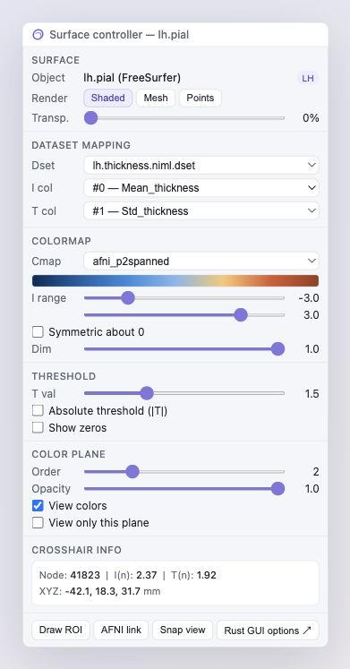

# egui Controller Reference

This note preserves the SUMA surface controller mockup for the first pass at
native `egui` controllers.

## Design Intent

- Keep controller panels compact, inspector-like, and dense enough for repeated
  scientific work.
- Prefer grouped sections over large decorative cards.
- Use small uppercase section labels, tight rows, and stable label/value widths.
- Make controls feel like an immediate-mode desktop tool: sliders update numeric
  readouts, segmented buttons change modes, and checkboxes map directly to
  display state.
- Preserve the visual hierarchy: current surface first, dataset mapping second,
  overlay/colormap/threshold controls next, and pick/crosshair readout near the
  bottom.

## Candidate egui Structure

- `SurfaceController`: object label, hemisphere chip, render mode, surface
  transparency.
- `DatasetMappingController`: dataset selector, intensity column selector,
  threshold column selector, brightness column selector when available.
- `ColormapController`: color map combo box, gradient preview, intensity range,
  symmetric range toggle, dim/brightness scalar.
- `ThresholdController`: threshold value/range, absolute threshold toggle,
  show-zero behavior, clipping/masking mode.
- `ColorPlaneController`: plane order, opacity, visibility, solo/isolate mode.
- `CrosshairInfoPanel`: selected node, selected face when available, intensity,
  threshold, and XYZ/mm readout.
- `ActionRow`: draw ROI, AFNI link/session controls, snap view, screenshot or
  view preset actions.

## Implementation Notes

- Back the UI with shared controller state rather than renderer-local fields.
- Emit typed commands from widgets so keyboard shortcuts, AFNI messages, and UI
  panels can all drive the same state transitions.
- Store color-map definitions in the model layer; `egui` should render previews
  from the same color stops used by `wgpu`.
- Keep range sliders and numeric values in sync, and avoid hidden assumptions
  about column roles by exposing explicit column selection.
- Treat overlay planes as ordered data, not one-off viewer toggles, so multiple
  dataset layers can arrive naturally later.

## Preview Artifacts

- HTML preview: `previews/suma_surface_controller_preview.html`
- Rendered reference: `previews/suma_surface_controller_preview.png`
